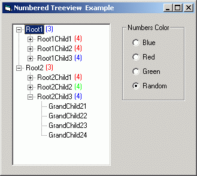



## Numbered TreeView

### Description

TreeView subclassing to adding a number at right of treeview text items (like Outlook Express)
 
### More Info
 

             |
---                |---
**Submitted On**   |2004-10-01 08:38:04
**By**             |[Giovanni Biagioni](https://github.com/Planet-Source-Code/PSCIndex/blob/master/ByAuthor/giovanni-biagioni.md)
**Level**          |Intermediate
**User Rating**    |4.7 (28 globes from 6 users)
**Compatibility**  |VB 6\.0
**Category**       |[Custom Controls/ Forms/  Menus](https://github.com/Planet-Source-Code/PSCIndex/blob/master/ByCategory/custom-controls-forms-menus__1-4.md)
**World**          |[Visual Basic](https://github.com/Planet-Source-Code/PSCIndex/blob/master/ByWorld/visual-basic.md)
**Archive File**   |[Numbered\_T1799201012004\.zip](https://github.com/Planet-Source-Code/giovanni-biagioni-numbered-treeview__1-56448/archive/master.zip)

